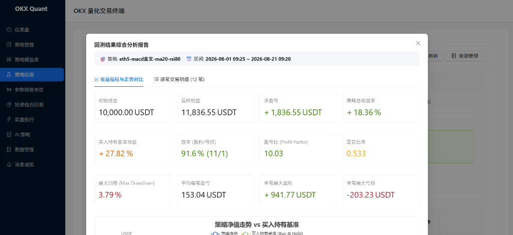

# OKX 量化交易系统 (OKX Quant Platform v2.0)

基于 **Python / FastAPI + React / TypeScript / Ant Design** 的现代化多因子量化交易与自动化回测执行系统。全面支持加密货币（Crypto）以及传统金融（TradFi）资产的大宗商品、贵金属、美股股票与指数 ETF 交易。

<p align="center">
  
</p>

---


## ✨ 核心特色与功能矩阵

### 1. 🪙 跨资产全品种支持 (Crypto & TradFi)
- **大宗商品与贵金属**：黄金 (`XAU-USDT-SWAP`)、白银 (`XAG-USDT-SWAP`)、原油 (`OIL-USDT-SWAP`)、铜 (`COPPER-USDT-SWAP`)、天然气 (`NG-USDT-SWAP`)。
- **美股热门股票**：英伟达 (`NVDA`)、特斯拉 (`TSLA`)、苹果 (`AAPL`)、微软 (`MSFT`)、亚马逊 (`AMZN`) 股票合约。
- **大盘指数与 ETF**：标普500 (`SPY`)、纳斯达克100 (`QQQ`)。
- **主流加密货币**：BTC、ETH、SOL、BNB、DOGE、XRP 等多币种永续与现货。
- **自定义品种管理**：支持自由创建、编辑、启停任意自定义股票、商品、外汇或衍生品标的。

### 2. 📉 全功能衍生品与多因子策略引擎
- **多空双向交易**：原生支持开多 (`OPEN_LONG`)、平多 (`CLOSE_LONG`)、开空 (`OPEN_SHORT`)、平空 (`CLOSE_SHORT`)。
- **跨周期共振多因子**：支持主周期（如 5m / 15m）与大级别趋势周期（如 1H / 4H / 1D）无未来函数指标对齐与共振滤波。
- **指标与形态库**：涵盖 MACD、RSI、KDJ、BOLL（含开口张开/收口）、BBI、CCI、MA 均线族及 15+ 种经典 K 线形态。
- **策略模版库**：预置 7 套经典策略模版（双均线趋势、布林带均值回归、MACD+RSI动量、KDJ极限波段、MACD低位金叉+MA20均线共振突破等），支持一键克隆应用。

### 3. 🤖 AI 闭环与自动化量化工具箱
- **AI 自然语言生成策略**：对接 DeepSeek / OpenAI 等大模型，输入自然语言需求直接生成结构化多因子策略。
- **AI 回测诊断与自动调优**：对回测结果进行风险与收益综合评级，自动诊断回撤与胜率瓶颈并一键派生“AI调优增强版策略”。
- **参数网格寻优 (Grid Optimizer)**：支持对止损、止盈、追踪止损及各指标参数执行自动化笛卡尔积网格搜索，输出最优参数组合。
- **多策略投资组合回测 (Portfolio)**：支持多品种、跨周期资产权重配置、相关性分析矩阵与组合综合权益曲线。

### 4. ⚡ 实盘执行与实时监控
- **WebSocket 实时行情**：内置低延迟 OKX WebSocket 行情接入与前端实时刷新。
- **多通道即时告警推送**：支持 Telegram、飞书 Webhook、企业微信、钉钉机器人，开平仓毫秒级成交推送。
- **智能实盘联动**：创建实盘实例自动带入策略预设标的、主周期与杠杆，支持逐仓独立风险隔离。

---

## 📁 目录结构概览

```text
.
├── app/                         # 后端 FastAPI 应用
│   ├── api/                     # REST API 路由
│   │   ├── dashboard.py         # 仪表盘数据 API
│   │   ├── market.py            # K 线历史同步与清洗
│   │   ├── backtest.py          # 回测执行与交易明细
│   │   ├── strategies.py        # 策略 CRUD 与模版库
│   │   ├── instances.py         # 实盘实例调度管理
│   │   ├── ai.py                # AI 策略生成与回测诊断
│   │   ├── symbols.py           # TradFi 与自定义品种管理
│   │   ├── optimizer.py         # 参数网格寻优
│   │   ├── portfolio.py         # 投资组合回测
│   │   ├── notifications.py     # 消息通知渠道配置
│   │   └── ws.py                # WebSocket 实时行情
│   ├── core/config.py           # 环境变量与系统配置
│   ├── db/                      # 数据库连接与无损迁移
│   ├── models/                  # SQLAlchemy 数据模型
│   ├── schemas/                 # Pydantic 数据模式定义
│   ├── services/                # 核心业务计算引擎
│   │   ├── backtest_engine.py   # 逐笔回测撮合引擎与指标计算
│   │   ├── strategy_engine.py   # 信号状态机与跨周期对齐
│   │   ├── strategy_templates.py# 预置量化策略模版库
│   │   ├── optimizer.py         # 网格搜索算法
│   │   ├── portfolio_engine.py  # 组合回测与相关性矩阵
│   │   ├── notification.py      # 多渠道通知网关
│   │   ├── okx_client.py        # OKX REST API 客户端
│   │   └── okx_ws.py            # OKX WebSocket 实时接入
│   ├── workers/live_trading.py  # 实盘执行调度器
│   └── main.py                  # FastAPI 主应用入口
├── frontend/                    # 前端 React + TypeScript 应用
│   ├── src/
│   │   ├── pages/               # 页面模块
│   │   │   ├── DashboardPage.tsx       # 资产与运行概览
│   │   │   ├── StrategiesPage.tsx      # 策略管理
│   │   │   ├── StrategyBuilderPage.tsx # 可视化策略构建器
│   │   │   ├── StrategyTemplatesPage.tsx # 策略模版库
│   │   │   ├── BacktestsPage.tsx       # 策略回测与深度分析
│   │   │   ├── OptimizerPage.tsx       # 参数网格寻优
│   │   │   ├── PortfolioPage.tsx       # 投资组合回测
│   │   │   ├── DataManagementPage.tsx  # K线下载与品种管理
│   │   │   ├── LiveTradingPage.tsx     # 实盘交易执行
│   │   │   ├── AiStrategyPage.tsx      # AI 策略助手
│   │   │   └── NotificationsPage.tsx   # 消息推送配置
│   │   ├── api.ts               # Axios 实例封装
│   │   └── App.tsx              # 路由与侧边导航布局
│   ├── package.json
│   └── vite.config.ts
├── docker-compose.yml           # Docker 一键编排文件
├── Dockerfile                   # 后端生产环境镜像配置
├── requirements.txt             # 后端 Python 依赖库
└── okx_quant.db                 # SQLite 数据库文件
```

---

## 🚀 快速启动指南

### 方式一：本地环境运行

#### 1. 后端启动 (FastAPI)
```bash
# 1. 安装 Python 依赖
pip install -r requirements.txt

# 2. 启动 FastAPI 后端服务
python -m uvicorn app.main:app --host 127.0.0.1 --port 8000 --reload
```
后端 API 交互文档：`http://127.0.0.1:8000/docs`

#### 2. 前端启动 (React + Vite)
```bash
# 进入前端目录
cd frontend

# 安装依赖
npm install

# 启动开发服务器
npm run dev
```
前端访问入口：`http://127.0.0.1:5173`

---

### 方式二：Docker 一键容器化部署

```bash
# 一键构建并后台启动全部服务
docker-compose up -d --build

# 查看运行日志
docker-compose logs -f
```

---

## ⚙️ 环境变量配置 (`.env`)

在项目根目录下创建 `.env` 文件：

```ini
# OKX API 交易密钥（实盘必须）
OKX_API_KEY=your_api_key_here
OKX_API_SECRET=your_api_secret_here
OKX_PASSPHRASE=your_passphrase_here
OKX_IS_SIMULATED=false

# AI 策略生成与调优大模型配置 (支持 DeepSeek / OpenAI 等)
AI_API_KEY=your_ai_api_key_here
AI_API_BASE_URL=https://api.deepseek.com/v1
AI_MODEL_NAME=deepseek-chat
```

---

## 📝 版本更新日志

### v2.0.0 (2026-08)
- 🪙 **TradFi 与自定义交易品种**：支持黄金、白银、原油、铜、天然气大宗商品与美股龙头合约（NVDA、TSLA、AAPL等），支持全功能自定义品种 CRUD。
- 🤖 **AI 回测诊断与自动调优**：综合评估胜率、盈亏比与回撤并自动生成增强版调优策略。
- 🔍 **参数网格寻优引擎**：支持多参数笛卡尔积网格搜索与热力榜单排行。
- 💼 **多策略投资组合回测**：支持跨品种跨周期权重分配与相关性走势矩阵。
- 📉 **合约做空与双向持仓**：完善做多/做空双向撮合与独立空头风控止盈止损。
- 🌊 **跨周期多因子共振**：支持小周期结合大周期趋势过滤。
- ⚡ **WebSocket 实时行情接入**。
- 🔔 **多渠道消息通知中心 (Telegram / 飞书 / 微信 / 钉钉)**。
- 📚 **策略模版库上线**：收录 7 款经典实测盈利模版。

### v1.2.0 (2025-12)
- 实盘交易记录详情与统计弹窗。
- 实盘实例启停与安全删除。
- 历史 K 线长周期下载优化。

---

## 📄 License
MIT License.
